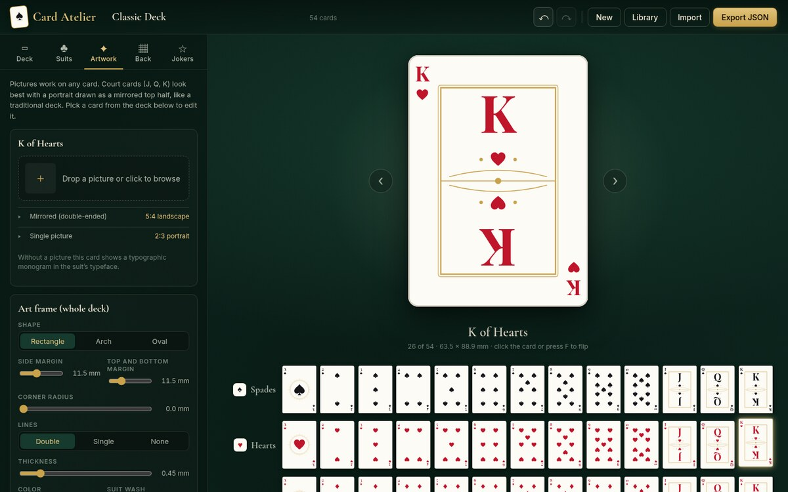

# Card Atelier

A browser app for designing playing card decks and exporting them as portable JSON. Hosted at **[card-atelier.tinyibex.com](https://card-atelier.tinyibex.com)**.



```sh
npm install
npm run dev     # http://localhost:5173
npm test        # model tests (schema, round trip, card list)
npm run build   # type check + production build in dist/
npm run schema  # regenerate docs/open-playing-cards.schema.json after changing src/model/open.ts
npm run deploy  # build and publish to Cloudflare Workers
```

Decks save automatically to the browser (IndexedDB). **Export** offers two formats:

- **Card Atelier file** (`<name>.deck.json`): everything needed to reopen and edit the deck. **Import** reads it back.
- **Open Playing Cards**: a finished PNG of every card and the back, plus suit, rank and value. **Use this one in games.** It does not depend on how Card Atelier draws cards, so it stays stable as the editor changes. Export it as one file (`<name>.cards.json`, images embedded) or as a zip of PNGs with a `deck.json` beside them, which is easier for game engines, at screen or print resolution, with optional 2 mm print bleed. The spec is in [docs/open-playing-cards.md](docs/open-playing-cards.md).

## Card Atelier file format (v1)

The editor's own format. Images and uploaded fonts are embedded as `data:` URIs. It changes as the editor gains features; games should read the Open Playing Cards export instead.

| Field | Meaning |
| --- | --- |
| `format`, `version` | Always `"playing-card-deck"` and `1`. Check both before loading. |
| `name`, `author`, `description` | Deck metadata. |
| `license`, `source` | How the deck may be used and where it came from, picked in Deck → Details. Copied into the Open Playing Cards export. |
| `card` | Physical size in mm (`widthMm`, `heightMm`, `cornerRadiusMm`), `background`, `border`, `accent` colors. |
| `suits[]` | `id`, `name`, `symbol`, `color`, `font` (`family`, `weight`), optional `pipImage`. |
| `ranks[]` | `id`, `label`, numeric `value` (A = 1 … K = 13), `lettering` (size and mm offsets for the corner index and court monogram, shared by every card of that rank). |
| `artFrame` | The picture window shared by face cards and jokers: `shape` (`rect`, `arch`, `oval`), margins, `cornerRadiusMm`, `lines` (`double`, `single`, `none`), `widthMm`, `color` (null follows the accent), `tint`. |
| `faces` | Pictures keyed by card id (`"hearts-K"`): `image`, `fit` (`scale`, `x`, `y`), `mirror`. |
| `back` | `kind` (`pattern` or `image`), `pattern`, `colors` [ground, ink], `image`, `border`. |
| `jokers` | `enabled` and `items[]` (`id`, `label`, `color`, `font`, `image`). |
| `fonts[]` | Where each font comes from: `google`, `system`, or `embedded` with `data`. |
| `cards[]` | A flat card list, one entry per card, in suit then rank order, jokers last when enabled: `{ id, kind, suit, rank, value, label, color }`. |

The editor rebuilds `cards` on every export and ignores it on import, so it always matches the rest of the file.

## License

[MIT](LICENSE). The Open Playing Cards format in [docs/](docs/open-playing-cards.md) is free for anyone to read or write, in any program.

The four decks Card Atelier starts you with (Classic, Noir, Art Deco and Botanical) are released under [CC0 1.0](https://creativecommons.org/publicdomain/zero/1.0/): use them, and anything you make from them, in anything at all, with no credit needed. Decks you design are yours; the Licence field in Deck → Details records what you allow, and is written into the Open Playing Cards export.
